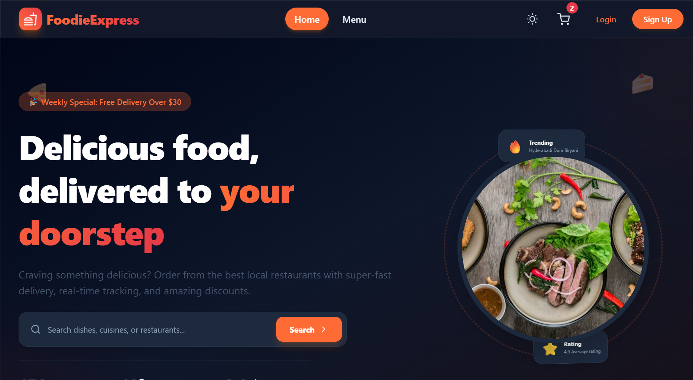
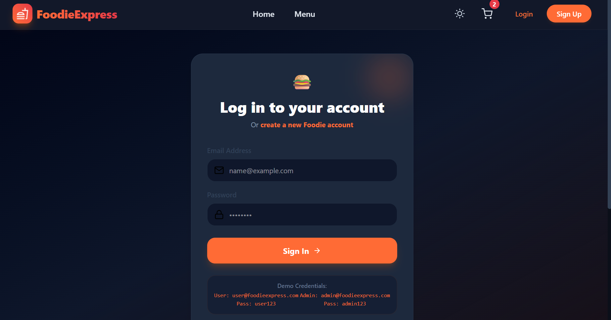
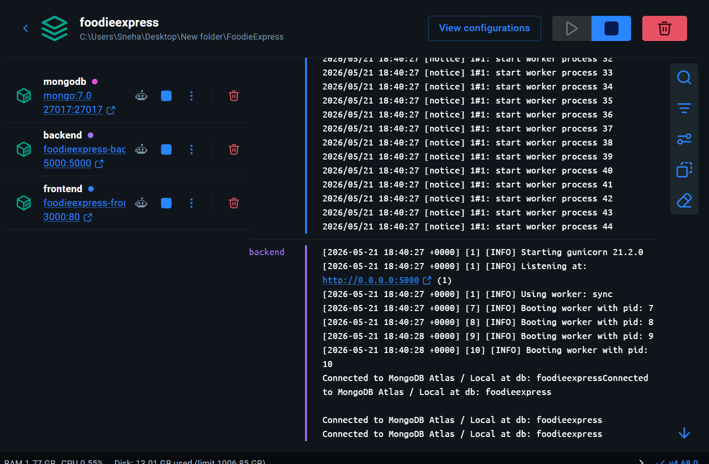
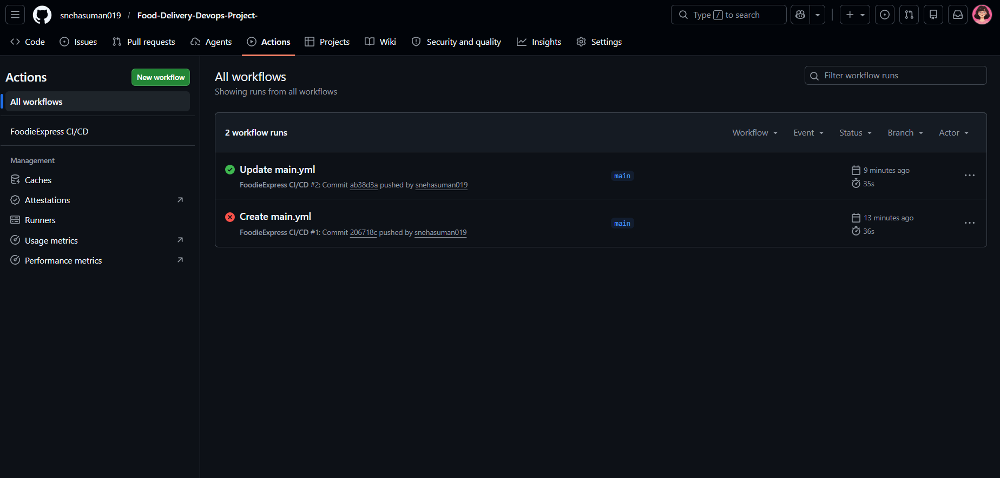

# 🍔 FoodieExpress - Food Delivery DevOps Project

A modern full-stack Food Delivery Web Application built using **React.js**, **Flask**, **MongoDB**, **Docker**, and **GitHub Actions CI/CD**.

---

# 🚀 Features

## 👤 User Features
- User Signup/Login Authentication
- JWT-based Authentication
- Browse Food Items
- Add to Cart
- Place Orders
- View Orders

## 🛠️ Admin Features
- Add Food Items
- Delete Food Items
- Manage Orders

## ⚙️ DevOps Features
- Dockerized Frontend & Backend
- Docker Compose Setup
- GitHub Actions CI/CD Pipeline
- Kubernetes Configuration Files
- Jenkins Pipeline File

---

# 🧰 Tech Stack

## Frontend
- React.js
- Vite
- Tailwind CSS
- Axios
- React Router DOM

## Backend
- Python Flask
- Flask-CORS
- JWT Authentication
- PyMongo

## Database
- MongoDB

## DevOps
- Docker
- Docker Compose
- GitHub Actions
- Jenkins
- Kubernetes

---

# 📁 Project Structure

```bash
FoodieExpress/
│
├── frontend/
├── backend/
├── kubernetes/
├── screenshots/
│
├── docker-compose.yml
├── Jenkinsfile
└── README.md
```

---

# 🐳 Docker Setup

## Run Project Using Docker

```bash
docker compose up --build
```

Frontend:
```bash
http://localhost:3000
```

Backend:
```bash
http://localhost:5000
```

---

# ⚙️ GitHub Actions CI/CD

This project uses GitHub Actions for Continuous Integration.

## Workflow Includes
- Installing dependencies
- Building frontend
- Building backend
- Docker image build automation
- Automatic execution on push

Workflow File:

```bash
.github/workflows/main.yml
```

---

# ☸️ Kubernetes

Basic Kubernetes deployment files are included inside:

```bash
kubernetes/
```

Includes:
- deployment.yaml
- service.yaml

---

# 🖥️ Screenshots

## Home Page


---

## 🔐 Login Page



---
## Docker Running


---

## GitHub Actions CI/CD


---


# 📌 Future Improvements

- Online Payment Integration
- Live Order Tracking
- AWS Deployment
- Notification System
- Microservices Architecture

---

# 👩‍💻 Author

Sneha Suman

GitHub:
https://github.com/snehasuman019

---

# ⭐ Project Status

✅ Frontend Completed  
✅ Backend Completed  
✅ Dockerized  
✅ GitHub Actions CI/CD Implemented  
✅ MongoDB Integrated  
✅ Docker Compose Working  

---

# 🛠️ Installation Guide

## Clone Repository

```bash
git clone https://github.com/snehasuman019/Food-Delivery-Devops-Project-.git
```

---

## Move Into Project Folder

```bash
cd FoodieExpress
```

---

## Run Using Docker

```bash
docker compose up --build
```

---

# 🔥 Local Development Setup

## Frontend

```bash
cd frontend
npm install
npm run dev
```

---

## Backend

```bash
cd backend
pip install -r requirements.txt
python app.py
```

---

# 📦 Docker Commands

## Build Containers

```bash
docker compose build
```

## Start Containers

```bash
docker compose up
```

## Stop Containers

```bash
docker compose down
```

---

# 📚 Learning Outcomes

This project helped in understanding:

- Full Stack Web Development
- REST API Development
- Docker Containerization
- GitHub Actions CI/CD
- Multi-container Architecture
- MongoDB Integration
- DevOps Workflow

---

# 📄 License

This project is developed for educational and learning purposes.

---
